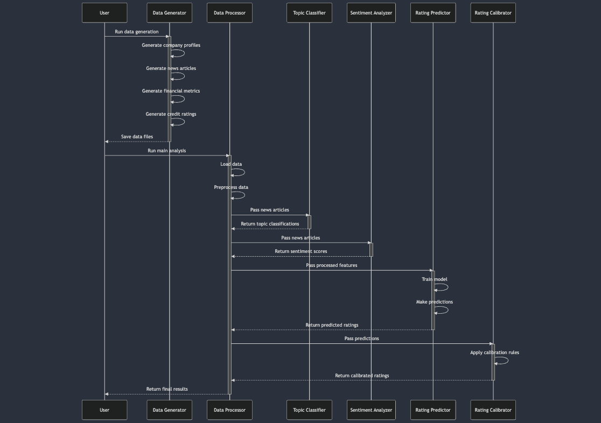

# Credit Rating Prediction System

A comprehensive system for predicting credit ratings using large language models (LLama2), financial metrics, and news sentiment analysis.

[X] Author: Mohammed Arif

## Project Structure
```
credit_rating_predictor/
├── src/
│   ├── data_generation/        # Data generation using LLama2
│   │   ├── __init__.py
│   │   └── llama_generator.py
│   ├── models/                 # Model implementations
│   │   ├── topic_classifier.py
│   │   ├── sentiment_analyzer.py
│   │   └── rating_predictor.py
│   ├── data/                   # Data processing modules
│   │   ├── data_loader.py
│   │   └── preprocessor.py
│   ├── utils/                  # Utility functions
│   │   └── config.py
│   └── calibration/            # Rating calibration
│       └── calibrator.py
├── scripts/                    # Utility scripts
│   └── generate_data.py
├── data/                       # Data storage
├── logs/                       # Log files
├── requirements.txt
├── config.yaml
└── main.py
```
## Execution Sequence



## Detailed Component Description

### 1. Configuration System

#### config.yaml
**What it does:**
- Stores external configuration settings
- Defines model parameters
- Sets data paths and processing parameters

**Why we need it:**
- Allows parameter changes without code modification
- Supports different environments (dev, prod, test)
- Makes configuration transparent and maintainable

**How it works:**
```yaml
model:
  topic_model_name: "llama2"
  sentiment_model_name: "ProsusAI/finbert"
  rating_model_type: "random_forest"
  use_gpu: true
  batch_size: 32
  max_length: 512

data:
  news_file: "data/news_articles.csv"
  company_file: "data/company_profiles.csv"
```

#### config.py
**What it does:**
- Validates configuration settings
- Provides type safety
- Sets default values
- Makes configuration accessible throughout the code

**Why we need it:**
- Ensures configuration correctness
- Provides IDE support
- Centralizes configuration management

**How it works:**
```python
class ModelConfig(BaseModel):
    topic_model_name: str = "llama2"
    sentiment_model_name: str = "ProsusAI/finbert"
    rating_model_type: str = "random_forest"
    use_gpu: bool = True
    batch_size: int = 32
```

### 2. Data Generation System (llama_generator.py)

**What it does:**
- Generates synthetic financial data using LLama2
- Creates realistic company profiles
- Generates news articles
- Produces financial metrics
- Creates credit rating histories

**Why we need it:**
- Provides controlled testing data
- Enables development without real data
- Ensures consistent data format

**How it works:**
```python
# Initialize generator
generator = LlamaDataGenerator(
    n_companies=100,
    n_articles_per_company=5
)

# Generate data
datasets = generator.generate_all_data()
```

### 3. Data Processing System

#### data_loader.py
**What it does:**
- Loads data from various sources
- Validates data structure
- Combines different data types

**Why we need it:**
- Centralizes data loading logic
- Ensures data consistency
- Handles data validation

**How it works:**
```python
loader = DataLoader()
news_data = loader.load_news_articles()
company_data = loader.load_company_profiles()
```

#### preprocessor.py
**What it does:**
- Cleans and prepares data
- Creates features for models
- Handles different data types
- Normalizes numerical data

**Why we need it:**
- Prepares data for modeling
- Ensures consistent feature format
- Improves model performance

**How it works:**
```python
preprocessor = DataPreprocessor()
X, feature_names = preprocessor.prepare_features(
    combined_data,
    ratings_data
)
```

### 4. Model System

#### topic_classifier.py
**What it does:**
- Classifies news articles into categories
- Uses LLama2 for classification
- Provides confidence scores

**Why we need it:**
- Organizes news by topic
- Enables topic-based analysis
- Provides feature for rating prediction

#### sentiment_analyzer.py
**What it does:**
- Analyzes news sentiment
- Uses FinBERT model
- Provides sentiment scores

**Why we need it:**
- Captures market sentiment
- Adds qualitative factors
- Enhances rating prediction

#### rating_predictor.py
**What it does:**
- Predicts credit ratings
- Combines multiple data sources
- Provides confidence scores

**Why we need it:**
- Core rating prediction
- Integrates various signals
- Produces initial ratings

### 5. Main Script System (main.py)

**What it does:**
- Orchestrates the entire prediction process
- Handles component initialization
- Manages data flow
- Controls execution sequence

**Components and Their Purpose:**

1. **Logging Setup**
```python
def setup_logging():
    log_dir = Path("logs")
    timestamp = datetime.now().strftime("%Y%m%d_%H%M%S")
    log_file = log_dir / f"credit_rating_{timestamp}.log"
```
- Creates timestamped log files
- Enables both console and file logging
- Maintains execution history

2. **Component Initialization**
```python
data_loader = DataLoader()
preprocessor = DataPreprocessor()
sentiment_analyzer = SentimentAnalyzer()
rating_predictor = RatingPredictor()
calibrator = RatingCalibrator()
```
- Initializes all necessary components
- Sets up processing pipeline
- Prepares system for execution

3. **Data Loading and Processing**
```python
# Load data
news_data = data_loader.load_news_articles()
company_data = data_loader.load_company_profiles()
ratings_data = data_loader.load_credit_ratings()
financial_data = data_loader.load_financial_metrics()

# Preprocess
combined_data = data_loader.combine_data()
X, feature_names = preprocessor.prepare_features(combined_data, ratings_data)
```
- Loads required datasets
- Combines different data sources
- Prepares features for modeling

4. **Model Training and Prediction**
```python
metrics = rating_predictor.train(
    data_splits['train'][feature_names],
    data_splits['train']['rating'],
    data_splits['validation'][feature_names],
    data_splits['validation']['rating'],
    optimize=True
)
```
- Trains the prediction model
- Validates performance
- Generates predictions

### 6. Calibration System (calibrator.py)

**What it does:**
- Adjusts raw model predictions
- Incorporates domain knowledge
- Applies business rules

**Why we need it:**
- Improves prediction accuracy
- Adds industry-specific adjustments
- Handles special cases

**How it works:**
```python
class RatingCalibrator:
    def __init__(self):
        self.industry_adjustments = {}
        self.market_conditions = {}
        
    def calibrate_rating(self, 
                        predicted_rating: str,
                        company_data: Dict[str, Any],
                        sentiment_data: Dict[str, float]) -> Dict[str, Any]:
        # Apply industry adjustments
        # Consider market conditions
        # Factor in sentiment
        return calibrated_rating
```

### 7. Error Handling and Logging

**Logging System:**
```python
logger = logging.getLogger(__name__)

# Information logging
logger.info("Starting credit rating prediction process")

# Error handling
try:
    # Process execution
    logger.info("Loading data...")
except Exception as e:
    logger.error(f"Error in process: {str(e)}")
    raise
```

**Error Types and Handling:**
1. Data Loading Errors
   - Missing files
   - Invalid data format
   - Corrupted data

2. Processing Errors
   - Invalid features
   - Data type mismatches
   - Missing values

3. Model Errors
   - Training failures
   - Prediction errors
   - Invalid output

### 8. Setup and Installation

1. **Environment Setup**
```bash
# Create virtual environment
python -m venv venv

# Activate environment
# Windows
venv\Scripts\activate
# Linux/Mac
source venv/bin/activate
```

2. **Install Dependencies**
```bash
pip install -r requirements.txt
```

3. **Ollama Setup**
```bash
# Install Ollama
curl https://ollama.ai/install.sh | sh

# Start Ollama
ollama serve

# Pull Llama2
ollama pull llama2
```

### 9. Usage Examples

1. **Generate Synthetic Data**
```python
from src.data_generation.llama_generator import LlamaDataGenerator

# Initialize generator
generator = LlamaDataGenerator(
    n_companies=100,
    n_articles_per_company=5
)

# Generate data
datasets = generator.generate_all_data()
```

2. **Run Complete Analysis**
```bash
# Generate data first
python scripts/generate_data.py

# Run main analysis
python main.py
```

3. **Use Individual Components**
```python
# Use sentiment analyzer
from src.models.sentiment_analyzer import SentimentAnalyzer

analyzer = SentimentAnalyzer()
sentiments = analyzer.analyze_sentiment(articles)

# Use rating predictor
from src.models.rating_predictor import RatingPredictor

predictor = RatingPredictor()
ratings = predictor.predict(features)
```

### 10. Output Structure

1. **Data Files**
```
data/
├── company_profiles.csv
├── news_articles.csv
├── credit_ratings.csv
└── financial_metrics.csv
```

2. **Results**
```
output/
├── predictions_[timestamp].csv
├── model_[timestamp].joblib
└── performance_metrics_[timestamp].json
```

3. **Logs**
```
logs/
└── credit_rating_[timestamp].log
```

### 11. Best Practices

1. **Code Organization**
   - Keep related functionality together
   - Use clear file and function names
   - Maintain consistent coding style

2. **Error Handling**
   - Always use try-except blocks
   - Log errors appropriately
   - Provide meaningful error messages

3. **Configuration**
   - Use config files for parameters
   - Never hardcode values
   - Document all configuration options

4. **Data Processing**
   - Validate input data
   - Handle missing values
   - Document data transformations

### 12. Troubleshooting

Common issues and solutions:

1. **Ollama Connection Issues**
```
Error: Could not connect to Ollama
Solution: Ensure Ollama is running with 'ollama serve'
```

2. **Memory Issues**
```
Error: MemoryError during processing
Solution: Reduce batch_size in config.yaml
```

3. **Model Loading Issues**
```
Error: Model not found
Solution: Ensure all models are properly downloaded
```

### 13. Contributing

1. Fork the repository
2. Create your feature branch
3. Commit your changes
4. Push to the branch
5. Create a Pull Request
